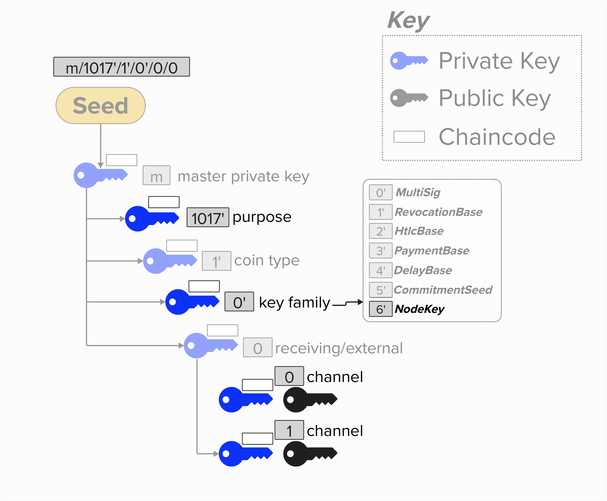
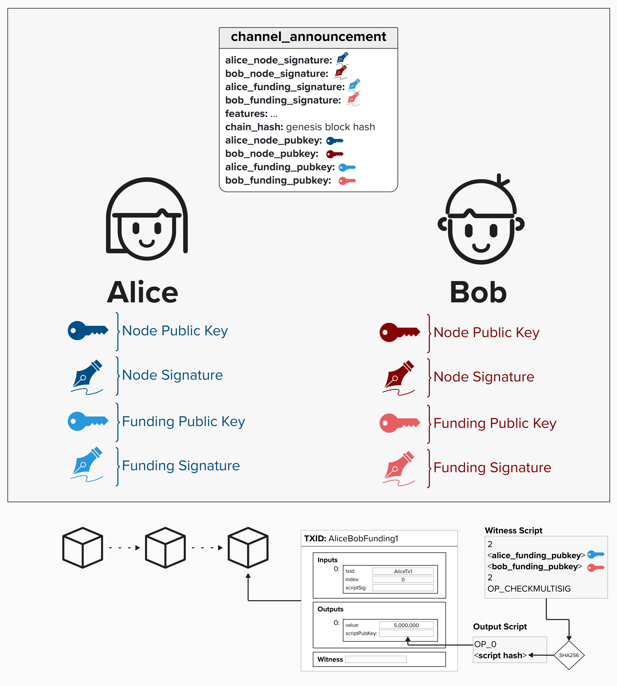

# Securing Lightning Network Communication

So, we've learned that Alice and Bob will leverage one of the TCP/IP protocols (IPv4, IPv6, or Tor) to communicate with each other. That said, we're not in the clear yet! While these protocols provide a pretty robust, standardized way to send data, they do not include encryption or authentication. This means, if Alice and Bob were to use TCP/IP alone, their data would be public for onlookers to see, and they wouldn't have strong assurance that they are actually communication with each other.

<p align="center" style="width: 50%; max-width: 300px;">
  
</p>

## Why Not TLS?
At this point, it shouldn't be a big spoiler alert that Lightning does not use Transport Layer Security (TLS). After all, each visual we've seen up until this point has said "Noise Protocol". However, it's worth elaborating on *why* Lightning does not use TLS as its encryption, authentication, and data integrity solution.

One key reason that Lightning does not use TLS is that, in TLS, a **Certificate Authority**, such as [DigiCert](https://www.digicert.com/), will issue certificates to domains on the internet to attest to the legitimacy of those domains. For example, when you connect to GitHub, they will send you a certificate with their public key. Your browser will then check if the certificate is from a Certificate Authority that it trusts. If so, it trusts the public key truly belongs to GitHub.

Chances are that you can see why Lightning developers opted to **not** include TLS in the networking stack! If Lightning relied on a Certificate Authority to validate public keys for Lightning nodes, that would introduce a pretty large centralization attack vector. Additionally, according to [Mastering Lightning](https://github.com/lnbook/lnbook/blob/develop/14_encrypted_transport.asciidoc), Lightning protocol developers believed that TLS had experienced protocol bloat over the several decades it's been around. Between the Certificate Authority dilema, the protocol complexity, and the various vulnerabilities that have been surfaced over the years, Lightnign developers felt that it was ideal to go with a newer, more flexible encryption framework instead - the Noise Protocol. 

## Why Public Keys?

So far, TCP/IP has gotten us very far in our networking stack, providing us with a way to define the location of where we'd like to send data to and how we'd like to transport it effectively. However, as we just learned, we still missing key components. 

#### Question: Imagine Alice connects to 198.51.100.89:9735 and starts sending messages. Can she be sure she is actually communicating with Bob?

<details>
  <summary>Answer</summary>

No! If Alice simply connect to Bob's IP address, she has no guarentee that it's actually Bob. For instance, IP Addresses can change - perhaps Bob's Internet Service Provide (ISP) assigns him a new IP address. Or, worse, an attacker is intercepting the traffic heading to Bob's IP address and pretends to be Bob.

What we really want is a way for Alice to **authenticate** her communication with Bob. In other words, we want a protocol that allows Bob to *prove* to Alice that he is actually the one sending the messages to her (and vice versa). Additionally, we also want our protocol to support **encryption**, meaning that only the intended recipient will be able to read the data contents of the message being sent. To everyone else, it will look like random text!

Luckily for us, cryptography provides us with the tools to achieve **authentication** and **encryption**, and much of the rest of this course will focus on how we can leverage cryptography to achieve those goals on the Lightning Network.

</details>

Great, we're moving along nicely! In the below diagram, you can see that, in addition to an IP address, Alice and Bob now both have a **public key**, which they can use to authenticate, themselves and encrypt messages over Lightning. Since IP address can change, their public key will serve as their Lightning node's **long-term identity**.

<p align="center" style="width: 50%; max-width: 300px;">
  
</p>


## Where Do The Public Keys Come From?

Various Lightning implementations (LND, LDK, Eclair, C-Lightning, etc.) implement key derivation differently. Below is an example that is, roughly, based on how LND derives keys for each Lightning node.

> NOTE: The full explanation of Lightning channel keys is outside the scope of this workshop. If you'd like to learn about that, please visit the first module: Intro to Payment Channels.

With that said, it's worth briefly discussing how one could build a Lightning wallet such that their node's public and private key could be derived from a single seed - along with all of the other keys that are needed to operate a Lightning channel.

### HD Wallets

BIP 32  describes a **hierarchical deterministic** (**HD**) wallet structure and introduces the following characteristics for key management:
- **Single Source**: All public and private keys can be derived from a single seed. As long as you have access to the seed, you can re-derive the entire wallet.
- **Hierarchical**: All keys are organized into a tree structure.
- **Deterministic**: Each time you restore you wallet from your seed, you'll get the exact same result.

### Derivation Paths
A few important BIPs, such as [BIP 43](https://bips.dev/43/) and [BIP 44](https://bips.dev/44/), build on BIP 32 and describe the following derivation scheme that can be used to organize keys.
```
m / purpose' / coin_type' / account' / change / address_index
```

We can leverage the above scheme to build an HD wallet that can provide us with all of the keys we'll need to operate a Lightning node.

<p align="center" style="width: 50%; max-width: 300px;">
  
</p>

Here is how to interpret the above scheme:
- `m`: This is the master extended key for the wallet, derived from our wallet's seed.
- `purpose'`: We'll use `1017'` for the purpose. This is the value that LND uses. Since our key derivation scheme is LND-inspired, we'll use it too! That said, it's an arbitrary choice and not specified in any Bitcoin or Lightning protocol specification. We're simply using it as a unique value to plug into the derivation scheme.
- `coin_type'`: Since we're ultimately testing our Lightning implementation against the BOLT Test Vectors, we'll use `0` for this course. Remember, `0` is mainnet bitcoin.
- `account'`: This is where the magic happens. We'll specify a specific **key family** for each `account`. This will enable us to deterministically derive unique public and private keys for each channel our Lightning node opens.
- `receiving`: We won't be generating any change addresses with this field, so we'll keep `0` (receiving) as a default value here.
- `index`: The index will be unique for each channel we open.

#### The key takeaway here, is that we can derive a node Public/Private key for our node by using the key derived at the following index:

```
m / 1017' / 0' / 6' / 0 / 0
```

### Sybil Attack Prevention

At this point, a valid concern one may have is how the Lightning Network protects against sybil attacks. Since there is no central authority to issue certificates to trusted domains, what's stopping an attacker from creating hundreds, thousands, or more nodes and flooding the Lightning Network with messages?

#### Question: How does the Lightning Protocol protect against Sybil attacks without relying on a central authority?

> HINT: Part of the answer has to do with the [`channel_announcement`](https://github.com/lightning/bolts/blob/master/07-routing-gossip.md#the-channel_announcement-message) message!

<details>
  <summary>Answer</summary>

To mitigate against sybil attacks in Lightning - a decentralized system where anyone is free to join - the protocol **suggests** that nodes ignore gossip messages from public keys that **do not** have a public channel open on the Lightning Network. This has the result of imposing a real-world monetary cost to sending messages on the Lightning Network, since, to open a public Lightning channel, you must spend bitcoin and allocate funds on-chain.

To prove to the wider network that you have publically opened a channel, you will broadcast a `channel_announcement` message when opening a channel. This message will include the both public keys that are present in the 2-of-2 multisig funding transaction and signatures that sign the content of the `channel_announcement` message itself. Crucially, these signatures will be produced by **both** the private keys associated with the public keys *in the funding output* and the Lightning node's public key - proving to the entire network that both parties truly locked funds in an on-chain output and that they attest `channel_announcement` message itself. 

For anyone who wishes to validate the channel announcement, the [`short_channel_id`](https://github.com/lightning/bolts/blob/master/07-routing-gossip.md#definition-of-short_channel_id) field contains a pointer to where they can find the funding transaction in the bitcoin blockchain.

<p align="center" style="width: 50%; max-width: 300px;">
  
</p>

</details>