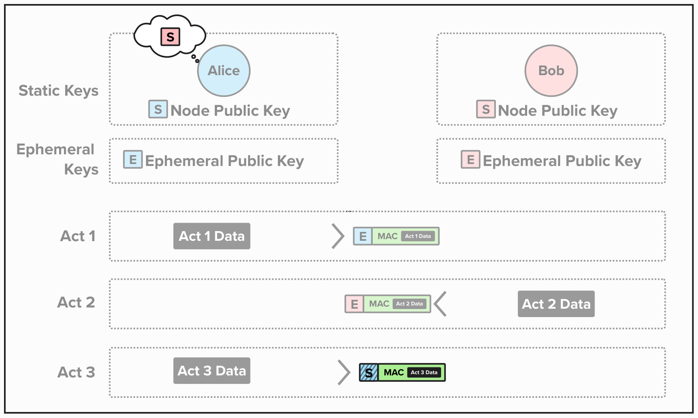

# Noise Protocol - A Flexible Framework

The Noise Protocol is, by design, flexible and allows developers to customize it to best suit their needs. For example, Noise can be used for one-way authentication, where a sender simply transmits encrypted information to a recipient, or it can be used for *interactive protocols* such as Lightning, where parties must send encrypted communicated back-and-forth.

The Noise Protocol can be broken into two phases:

1) **Handshake**: The handshake phase used to **authenticate** and establish a **shared secret** between two parties. There are many types of handshake patterns that the Noise Protocol supports, and Lightning uses the `XK` pattern. We'll learn more about these below.
2) **Messaging**: Once the handshake phase is complete and a shared secret has been established, parties can begin to send and receive encrypted communications.

To define the specific Noise Protocol that is being used, you simply concatenate your implementation's choice of handshake pattern, Diffie-Hellman function, cipher function, and hash function - all separated by an underscore. Below is Lightning's Noise implementation name.

  

 

## Handshake Patterns
Most of the components of Lightning's Noise Protocol name should be familiar. After all, we revieweved secp256k1, ChaCha20Poly-1305, and SHA256 in the previous section! That said, the handshake pattern is not as clear, so it's worth elaborating on that a little further.

Since the Noise Protocol is meant to be flexible and highly customizable, it support multiple handshake patterns with various levels of authentication - from no authentication to mutual authentication. To idenfify which flavor of handshake is being used, the Noise Protocol defines handshake pattern using two-character names, where the first character describes the status of the initiator's **static key** and the second describes the responder's.

For example, the Lightning network uses the `XK` handshake pattern. In this case, `X` means that the initiator's **static key** (their Lightning node's public key) is *transmitted* during the handshake phase. `K` means that the responder's **static key** is *known* ahead of time. If you've ever opened a new connection on the Lightning Network, this should be familiar to you, as you would have had to specify the public key identity of the node you're connecting to!

Below is a simplified visual depicting the handshake pattern for Lightning nodes. As you can see, Alice - the initator of this connection - knows Bob's static key beforehand. After performing a few cryptographic proofs, which effecitvely allow Alice and Bob to prove their identity, Alice will send Bob an encrypted version of her static key during the final Act. If your bummed that we just glanced over most of the cryptography - don

  

This handshake patter, known as **XK**, is one of many that the Noise Protocol supports. If you'd like to learn which other patterns are supported, two tables are provided below. The first table lists each character and its meaning for the **initiator** of a connection, and the second table defines the character and meaning for the **responder** of a channel.

### Initiator's Static Key (First Character)

| Character | Meaning | Description |
|-----------|---------|-------------|
| **N** | **N**o static key | Initiator has no static key (anonymous to responder) |
| **K** | Static key **K**nown | Initiator's static key is already known by responder before handshake |
| **X** | Static key **X**mitted | Initiator transmits their static key during handshake |
| **I** | **I**mmediately transmitted | Initiator sends static key immediately in first message, with reduced/no identity hiding |

### Responder's Static Key (Second Character)

| Character | Meaning | Description |
|-----------|---------|-------------|
| **N** | **N**o static key | Responder has no static key (anonymous to initiator) |
| **K** | Static key **K**nown | Responder's static key is already known by initiator before handshake |
| **X** | Static key **X**mitted | Responder transmits their static key during handshake |

