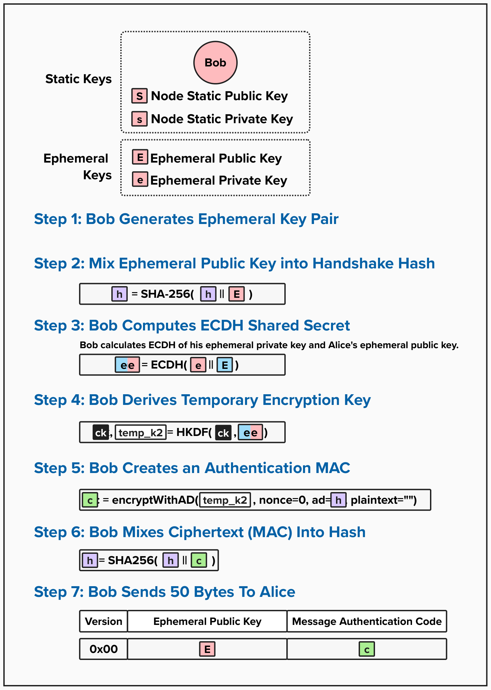
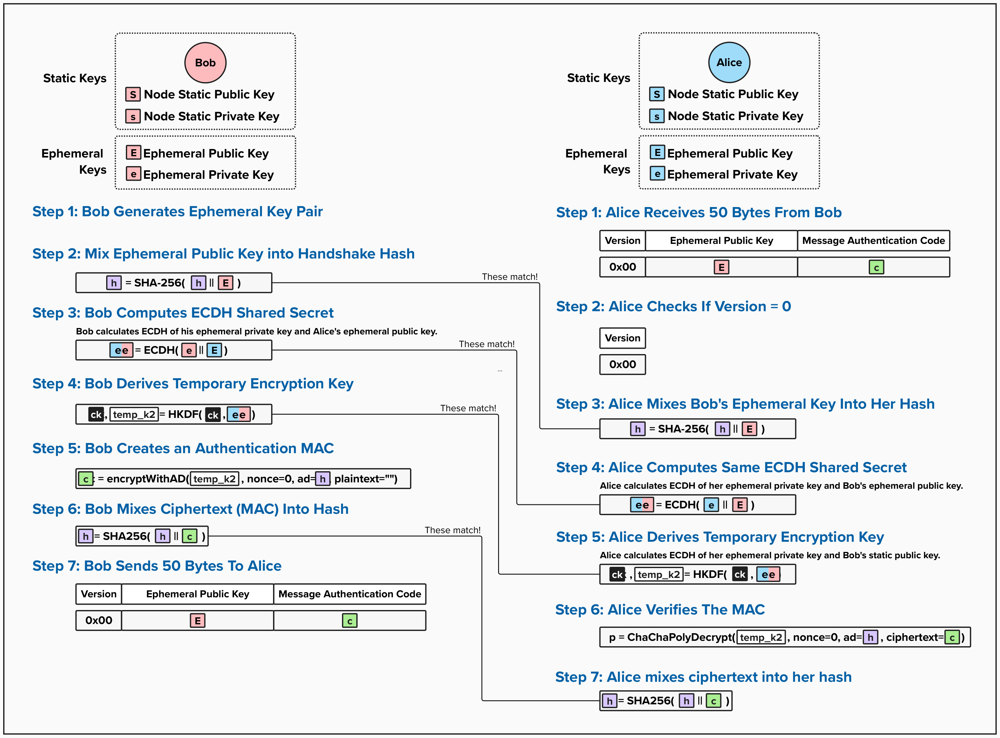

# Noise Protocol: Act 2

So far, Alice has proven to Bob that she knows his identity by sending a Message Authentication Code (MAC), using a secret key that was created using a shared secret derived from Bob's Static Public Key. Additionally, since this MAC included the handshake hash as Associated Data, Bob was able to verify that him and Alice are using the same Noise variant. Pretty cool that we were able to do all that with just complex math!

Now that Bob knows Alice means business, it's time for him to join in on the fun by sending some information back to Alice! In Act 2, Bob will create his own Ephemeral Key Pair to send to Alice. This is a crucial part of the Noise protocol, as it ensures that the encryption keys for each Noise connection are random, and each party provides entropy that contributes towards that randomness.

For instance, imagine if Alice and Bob's shared secret was based on their Static Public Keys. Then, their shared secret would not be unique to this specific connection! If they disconnect and reconnect 1,000 times, they will have the same shared secret (and, thus, encryption keys) every time!

## Act 2: Bob's Point-of-View

  

### Step 1: Bob Generates Ephemeral Key Pair
First, Bob will generate his own Ephemeral Public and Private Key. This keypair is unique to this Noise connection instance. If Bob were to disconnect and reconnect to Alice, he would generate an entirely new Ephemeral Key Pair, ensuring that each connection uses distinct and random encryption keys.

### Step 2: Bob Mixes Ephemeral Public Key into Handshake Hash
Next, Bob will mix his Ephemeral Public Key into the handshake hash. Remember, the handshake hash acts as a **transcript**, recording all important steps in the handshake process.

### Step 3: Bob Computes ECDH Shared Secret
Next, Bob will derive a shared secret, using his Ephemeral Private Key and Alice's Ephemeral Public Key. By doing this, Bob ensures that the entropy used to create encryption keys is independent from his Static Key Pair. So, if his Static keys are even compromised, the attacker would still be unable to decrypt messages sent over this channel.

### Step 4: Bob Derives Temporary Encryption Key
Bob will then derive a new **Temporary Key** (`temp_k2`) and update his **Chaining Key** so that it now contains accumulated key material from ECDH operations in Act 1 and Act 2. Similar to `temp_k1`, `temp_k2` will be used as a one-time key to generate a MAC for Bob's communication to Alice.

### Step 5: Bob Creates an Authentication MAC
Once Bob has his one-time temporary key, he will generate a MAC for his message to Alice. Remember, the Bob's goal for Act 2 is to send Alice his Ephemeral Public Key, and the MAC serves as a way for Alice to authenticate Bob, confirming the message came from him, and ensure the message's integrity - meaning it was not altered in transit.

### Step 6: Bob Mixes Ciphertext (MAC) Into Hash
Bob will mix the MAC into the handshake hash, bringing the hash up to sync with all of Bob's cryptographic operations for Act 2.

### Step 7: Bob Sends 50 Bytes To Alice
Finally, Bob will send Alice a 50-byte message with the following structure:
- **Byte 1**: The first byte will be the version. As of now, the only valid version is `0`. If the version is anything other than this, Alice will reject the connection.
- **Bytes 2-34**: The next 33 bytes will be Bob's Ephemeral Public Key (in Bitcoin's compressed format). This is not encrypted, as Alice will need to use this to calculate the ECDH shared secret. Since Bob's Ephemeral Public Key is not linked to his Lightning node's identity, transmitting this in plain text does not leak any personal data.
- **Bytes 35-50**: The last 16 bytes are the message authentication code produced by the ChaCha20-Poly1305 encryption algorithm.

## Act 2: Alice's Point-of-View

  

Once Alice receives Bob's message, her primary goal is to validate Bob's Ephemeral Public Key. Let's see how it's done!

### Step 1: Alice Receives 50 Bytes From Bob
Just like Bob did in Act 1, Alice will first read exactly 50 bytes from the network buffer and parse the message into the following three components:
- **Version** (1 byte): The handshake version number.
- **Ephemeral Public Key** (33 bytes): Bob's Ephemeral Public Key.
- **Message Authentication Code** (16 bytes): The MAC that Bob created with `temp_k2` and the handshake hash as associated data.

### Step 2: Alice Checks If Version = 0
Before processing the message further, Alice will validate that the version byte equals `0x00`. If it's not `0x00`, Alice will abort the connection!

### Step 3: Alice Mixes Bob's Ephemeral Key Into Her Hash
Alice will then mix Bob's Ephemeral Public Key into her handshake hash. At this point, her hash should exactly match Bob's hash from his Step 2. As we've seen many times now, Alice will continue to update her handshake hash to stay synchronized with Bob's.

### Step 4: Alice Computes Same ECDH Shared Secret
Next, Alice will take her Ephemeral Private Key and Bob's Ephemeral Public Key and compute the **ephemeral-ephemeral shared secret** using ECDH. Due to the properties of ECDH, the result will be the exact same shared secret that Bob produced in his Step 3.

While this is the second ECDH Alice and Bob have performed, it's quite special because it only uses Ephemeral Public Keys. Therefore, even if both Alice's and Bob's Static Keys are compromised in the future, all communication encrypted in this Noise session will remain secure because both ephemeral private keys will be destroyed after the handshake completes. We'll revisit this later!

### Step 5: Alice Derives Temporary Encryption Key
Alice will then derive **Temporary Key 2** (`temp_k2`) and update her **Chaining Key** (`ck`). The temporary key, `temp_k2`, will allow her to verify the MAC that Bob sent over, while the chaining key `ck` is continuing to "chain" together shared secrets from each ECDH operation, thus incorporating all of the entropy into each new chaining key.

### Step 6: Alice Verifies The MAC
Once Alice has `temp_k2`, the ciphertext (`c`) that Bob sent in his message, and an updated handshake hash (`h`), she can decrypt and verify the MAC using the ChaCha20-Poly1305 cipher.

If the MAC is invalid, the function will fail with an authentication error, and Alice will immediately terminate the connection.

### Step 7: Alice Mixes Ciphertext Into Her Hash
Finally, Alice will mix the ciphertext into her hash, synchronizing her handshake hash with Bob's. With this step complete, both Alice and Bob now have:
- Two completed ECDH operations (`es` and `ee`) mixed into their chaining keys.
- Synchronized handshake hashes.
- Mutual forward secrecy from the ephemeral-ephemeral exchange.

Alice is now ready to proceed to Act 3, where she will reveal her static public key to Bob in encrypted form!

## Act 2 Summary
With that, Act 2 is complete! Bob has confirmed to Alice that he successfully validated her Act 1 message, and both parties have now completed the ephemeral-ephemeral ECDH exchange. This provides **mutual forward secrecy** - even if both Alice's and Bob's static keys are compromised in the future, this session will remain secure.

At this point, Alice and Bob have accumulated two shared secrets (`es` and `ee`) into their chaining keys, and both parties have contributed fresh randomness to the session. Up next, we'll see Act 3, where Alice finally reveals her identity to Bob in encrypted form, completing the authentication handshake!